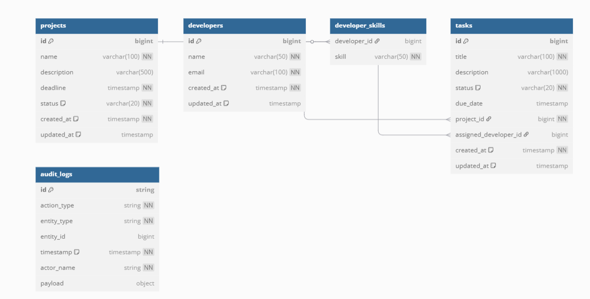

# ProjectTracker - Advanced Spring Boot Application

## Overview

ProjectTracker is a comprehensive project management system built with Spring Boot that demonstrates advanced enterprise-level concepts including:

- **Multi-entity relationships** with JPA/Hibernate
- **Dual database support** (PostgreSQL + MongoDB)
- **Caching** for improved performance
- **Audit logging** with NoSQL storage
- **Pagination and sorting** for large datasets
- **Bulk operations** and advanced querying
- **Transaction management**
- **RESTful API design**
- **Swagger/OpenAPI documentation**
- **Type-safe enums** and comprehensive validation

## Table of Contents

- [Architecture](#architecture)
- [Database Schema](#database-schema)
- [System Architecture](#system-architecture)
- [Prerequisites](#prerequisites)
- [Database Setup](#database-setup)
- [Getting Started](#getting-started)
- [Advanced Features](#advanced-features)
- [Development](#development)
- [Performance Considerations](#performance-considerations)
- [Contributing](#contributing)

## Architecture

### Core Entities

- **Project**: Core project entity with tasks relationship
- **Developer**: User entity with skills and task assignments
- **Task**: Work items belonging to projects and assigned to developers
- **AuditLog**: MongoDB document for tracking all data changes

### Technology Stack

- **Backend Framework**: Spring Boot 3.5.0
- **Language**: Java 17
- **Primary Database**: PostgreSQL (relational data)
- **Audit Database**: MongoDB (audit logs)
- **Caching**: Spring Cache with ConcurrentMapCacheManager
- **Documentation**: Swagger/OpenAPI 3
- **Build Tool**: Maven
- **Validation**: Jakarta Validation
- **ORM**: Hibernate/JPA

## Database Schema

### Entity Relationship Diagram (ERD)




### Relationships

- **One Project → Many Tasks** (1:N)
- **One Developer → Many Tasks** (1:N)
- **One Developer → Many Skills** (1:N via ElementCollection)
- **All Entities → Many AuditLogs** (tracked in MongoDB)

## System Architecture

### High-Level Architecture Diagram




### Key Architectural Components

1. **Layered Architecture**: Clear separation of concerns
2. **Dual Database Strategy**: PostgreSQL for transactional data, MongoDB for audit logs
3. **Caching Layer**: Improves performance for frequently accessed data
4. **Audit Interceptor**: Automatic logging of all data changes
5. **DTOs**: Data transfer objects for API communication
6. **Global Exception Handling**: Centralized error management
7. **Transaction Management**: Ensures data consistency

## Prerequisites

- **Java 17** or higher
- **Maven 3.6+**
- **Docker** (for PostgreSQL and MongoDB)
- **Git** for version control

## Database Setup

### Using Docker (Recommended)

#### 1. Start PostgreSQL
```bash
# Create volume for persistent data
docker volume create postgres_data

# Run PostgreSQL container
docker run -d \
  -p 5432:5432 \
  -v postgres_data:/var/lib/postgresql/data \
  --name postgres \
  -e POSTGRES_DB=projecttracker \
  -e POSTGRES_USER=projecttracker_user \
  -e POSTGRES_PASSWORD=projecttracker_password \
  postgres:15
```

#### 2. Start MongoDB
```bash
# Create volume for persistent data
docker volume create mongodb_data

# Run MongoDB container
docker run -d \
  -p 27017:27017 \
  -v mongodb_data:/data/db \
  --name mongodb \
  mongo:latest
```

#### 3. Verify Both Databases are Running
```bash
docker ps
```

### Manual Installation Alternative

<details>
<summary>Click to expand manual installation instructions</summary>

#### PostgreSQL Manual Setup
```sql
-- Connect to PostgreSQL as superuser
CREATE DATABASE projecttracker;
CREATE USER projecttracker_user WITH PASSWORD 'projecttracker_password';
GRANT ALL PRIVILEGES ON DATABASE projecttracker TO projecttracker_user;
```

#### MongoDB Manual Setup
```bash
# Install MongoDB Community Edition
# Start MongoDB service
sudo systemctl start mongod
sudo systemctl enable mongod
```
</details>

## Getting Started

### 1. Clone the Repository
```bash
git clone https://github.com/ingabireol/ProjectTracker.git
cd ProjectTracker
```

### 2. Configure Application Properties

Update `src/main/resources/application.properties`:

```properties
# PostgreSQL Configuration
spring.datasource.url=jdbc:postgresql://localhost:5432/projecttracker
spring.datasource.username=projecttracker_user
spring.datasource.password=projecttracker_password

# MongoDB Configuration  
spring.data.mongodb.uri=mongodb://localhost:27017/projecttracker_audit

# Application Settings
spring.profiles.active=dev
```

### 3. Build and Run

#### Development Mode (with sample data)
```bash
mvn clean install
mvn spring-boot:run -Dspring.profiles.active=dev
```

#### Production Mode
```bash
mvn spring-boot:run
```

### 4. Verify Installation

- **Health Check**: http://localhost:8080/api/health
- **API Info**: http://localhost:8080/api/info
- **Swagger UI**: http://localhost:8080/swagger-ui.html

## API Documentation

### Swagger/OpenAPI Integration

The application includes comprehensive API documentation using OpenAPI 3.0:

- **Interactive Documentation**: http://localhost:8080/swagger-ui.html
- **OpenAPI JSON**: http://localhost:8080/api-docs
- **OpenAPI YAML**: http://localhost:8080/api-docs.yaml

### Key Features

- ✅ **Interactive Testing**: Test all endpoints directly from the browser
- ✅ **Request/Response Examples**: Comprehensive examples with sample data
- ✅ **Schema Documentation**: Detailed field descriptions and validation rules
- ✅ **Organized by Tags**: Endpoints grouped by functionality
- ✅ **Parameter Documentation**: Clear descriptions for all parameters
- ✅ **Error Response Documentation**: HTTP status codes and error structures


## Advanced Features

### 1. Caching Strategy

```java
// Automatic caching for frequently accessed data
@Cacheable(value = "projects", key = "#projectId")
public ProjectResponseDto getProjectById(Long projectId)

// Cache invalidation on updates
@CacheEvict(value = "projects", key = "#projectId")
public ProjectResponseDto updateProject(Long projectId, ...)
```

**Cached Operations:**
- Project details by ID
- Developer information
- Project details with tasks

### 2. Audit Logging

**Automatic Logging:**
- All CRUD operations tracked
- Before/after data for updates
- Actor identification
- Timestamp and payload storage

**Example Audit Log:**
```json
{
  "id": "648a1b2c3d4e5f6789012345",
  "actionType": "UPDATE",
  "entityType": "PROJECT", 
  "entityId": 1,
  "timestamp": "2024-06-11T10:30:00",
  "actorName": "john.doe",
  "payload": {
    "oldData": {"name": "Old Project Name"},
    "newData": {"name": "New Project Name"}
  }
}
```

### 3. Pagination and Sorting

```bash
# Basic pagination
GET /api/projects?page=0&size=10

# Sorting (multiple fields)
GET /api/projects?sort=name,asc&sort=createdAt,desc

# Combined pagination and sorting
GET /api/projects?page=0&size=5&sort=deadline,asc
```

### 4. Advanced Querying

**Custom JPQL Queries:**
```java
@Query("SELECT p FROM Project p WHERE p.tasks IS EMPTY")
List<Project> findProjectsWithoutTasks();

@Query("SELECT t FROM Task t WHERE t.dueDate < :currentDate AND t.status != 'COMPLETED'")
List<Task> findOverdueTasks(@Param("currentDate") LocalDateTime currentDate);
```

**Complex Filtering:**
```bash
# Multi-criteria task search
GET /api/tasks/search-criteria?projectId=1&status=IN_PROGRESS&developerId=2
```

### 5. Bulk Operations

```bash
# Bulk assign multiple tasks to a developer
POST /api/tasks/bulk-assign?taskIds=1,2,3&developerId=1

# Bulk update task status for entire project
POST /api/tasks/project/1/bulk-update-status?status=COMPLETED
```

### 6. Statistics and Analytics

**Available Statistics:**
- Project status distribution
- Developer task workload
- Task completion rates
- Audit activity metrics
- Skill distribution across developers

### 7. Type Safety with Enums

```java
public enum ProjectStatus {
    PLANNING, IN_PROGRESS, ON_HOLD, COMPLETED, CANCELLED
}

public enum TaskStatus {
    TODO, IN_PROGRESS, IN_REVIEW, COMPLETED, BLOCKED
}

public enum AuditAction {
    CREATE, UPDATE, DELETE
}
```

## Development

### Running Tests
```bash
mvn test
```

### Development Profile Features

Activate with: `-Dspring.profiles.active=dev`

**Includes:**
- Automatic sample data creation
- Detailed SQL logging
- Enhanced error messages
- Debug-level logging

**Sample Data Created:**
- 4 developers with different skill sets
- 3 projects in various stages
- 12 tasks with different statuses and assignments
- Overdue tasks for testing

### Code Structure

```
src/main/java/com/buildmaster/projecttracker/
├── config/          # Configuration classes
├── controller/      # REST controllers
├── dto/            # Data Transfer Objects
├── exception/      # Exception handling
├── model/          # JPA entities and MongoDB documents
├── repository/     # Data repositories
└── service/        # Business logic
    └── impl/       # Service implementations
```

### Database Debugging

```bash
# Check PostgreSQL data
docker exec -it postgres psql -U projecttracker_user -d projecttracker
\dt  # List tables
SELECT * FROM projects;

# Check MongoDB data  
docker exec -it mongodb mongosh
use projecttracker_audit
db.audit_logs.find().pretty()
```

## Performance Considerations

### Database Optimization

**PostgreSQL:**
- Proper indexing on frequently queried fields
- Connection pooling (HikariCP)
- Lazy loading for relationships
- Efficient bulk operations

**MongoDB:**
- Optimized for write-heavy audit operations
- Automatic indexing enabled
- Efficient querying with proper field selection

### Caching Strategy

- **Entity-level caching** for read-heavy operations
- **Cache invalidation** on updates
- **Configurable cache settings**

### Query Optimization

- **Custom JPQL queries** for complex operations
- **Pagination** for large datasets
- **Projection queries** for statistics
- **Bulk operations** for efficiency

## Error Handling

### Comprehensive Error Management

- **Global exception handler** for consistent error responses
- **Validation error details** with field-specific messages
- **Custom exception types** for different scenarios
- **Structured error responses** with timestamps and request context

**Example Error Response:**
```json
{
  "timestamp": "2024-06-11T10:30:00",
  "status": 400,
  "error": "Validation Failed",
  "message": "Invalid input parameters",
  "path": "/api/projects",
  "validationErrors": {
    "name": "Project name must be between 3 and 100 characters",
    "deadline": "Deadline is required"
  }
}
```

## Contributing

### Development Guidelines

1. **Follow established patterns** for entities, DTOs, services, and controllers
2. **Add appropriate validation** and error handling
3. **Include audit logging** for new operations
4. **Write comprehensive tests** for new functionality
5. **Update documentation** for significant changes
6. **Use conventional commit messages**

### Commit Message Convention

## License

This project is licensed under the MIT License - see the [LICENSE](LICENSE) file for details.

## Support

For questions and support:
- **Email**: support@buildmaster.com
- **Documentation**: http://localhost:8080/swagger-ui.html
### Pagination and Sorting
```bash
# Pagination
GET /api/projects?page=0&size=10

# Sorting
GET /api/projects?sort=name,asc&sort=createdAt,desc

# Combined
GET /api/projects?page=0&size=5&sort=deadline,asc
```

### Bulk Operations
```bash
# Bulk assign tasks
POST /api/tasks/bulk-assign?taskIds=1,2,3&developerId=1

# Bulk update task status for project
POST /api/tasks/project/1/bulk-update-status?status=COMPLETED
```

### Advanced Queries
- Find projects without tasks
- Get overdue projects and tasks
- Developer skill-based filtering
- Task statistics by project/developer
- Date range queries

## Development

### Running Tests
```bash
mvn test
```

### Development Profile
The application includes a development profile that:
- Enables detailed logging
- Shows SQL statements

Activate with: `-Dspring.profiles.active=dev`


## Performance Considerations

### Database Optimization
- Proper indexing on frequently queried fields
- Connection pooling configured
- Lazy loading for relationships
- Efficient bulk operations

### Caching Strategy
- Entity-level caching for read-heavy operations
- Cache invalidation on updates
- Configurable cache settings

### Audit Log Management
- MongoDB for scalable audit storage
- Cleanup endpoint for old logs
- Efficient querying with proper indexing

## Error Handling

The application includes comprehensive error handling:
- Global exception handler
- Validation error responses
- Custom exception types
- Structured error responses with timestamps

